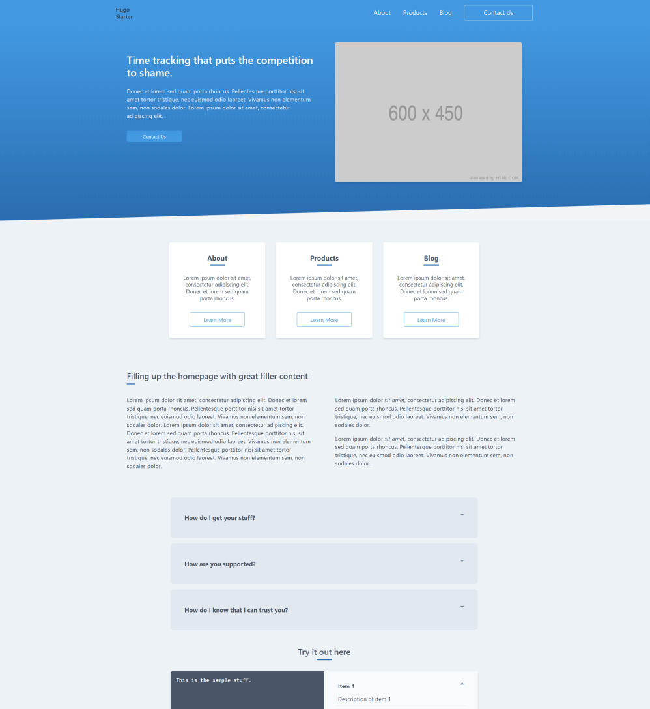

# Hugo Minimal

https://hugo-minimal.netlify.com/

This repo is a working example/template of a Hugo site using [TailwindCSS](https://github.com/tailwindcss/tailwindcss) and [Vue.js](https://vuejs.org/), and administered using [NetlifyCMS](https://www.netlifycms.org/). The CSS and JS are properly bundled and purged using [PurgeCSS](https://github.com/FullHuman/purgecss) and [Hugo Pipes](https://gohugo.io/hugo-pipes/). No Webpack, no bloated node_modules directory, just Hugo and nice utility-first CSS.

Homepage:

Admin interface (with page-building!):

Hats off to [budparr/hugopipes-tailwindcss](https://github.com/budparr/hugopipes-tailwindcss) for the first working version
of PurgeCSS and Tailwind with Hugo Pipes.

## Technical Notes

In 2018 [Forestry.io](https://forestry.io/blog/blocks-give-your-editors-the-power-to-build-pages/) released a "block" editing feature that let users essentially start doing easy page-building using Hugo. With [this PR](https://github.com/netlify/netlify-cms/pull/1857/) that landed in NetlifyCMS, it's now possible there as well. I've also added a "sections" level to specify a background color or other formatting to each area of blocks (see screenshot). You can see how this is set up in `layouts/partials/blockloader.html` and the CMS config in `static/admin/config.yml`. See the NetlifyCMS docs about variable-type lists [here](https://www.netlifycms.org/docs/beta-features/#list-widget-variable-types).

Tailwind and PurgeCSS are configured in `/assets/css/postcss.config.js` and `/assets/css/dev/postcss.config.js`. The decision for which gets config gets loaded (and Hugo Pipes magic) happens in `layouts/partials/header_includes.html`.

Vue is currently loaded from a CDN and all components you define are bundled in `layouts/partials/footer_includes.html`.

This uses SVG icons which are all loaded via an external reference from `static/images/symbol-defs.svg` (note: doesn't work in IE). See notes in `layouts/partials/icon.html`.

### Other Notes

- PurgeCSS will fail if any of your templates are empty.
- If you add themes, you need to add the file location in the PurgeCSS `content` configuration item.

## Useful things

[Embed Responsively](http://embedresponsively.com/) will give you YouTube/Vimeo embed codes that work responsively (see 1up-media.html template partial for example).

Photos are not automatically resized when added through NetlifyCMS, so resize/crush them before uploading.

Getting familiar with [Go templates](https://golang.org/pkg/text/template/) is very handy for working with Hugo. Here's a [good tutorial](https://code.tutsplus.com/tutorials/text-generation-with-go-templates--cms-30441).

Pretty printing Hugo variables for debug: https://github.com/kaushalmodi/hugo-debugprint

Find the right syntax for your YAML multiline strings - https://yaml-multiline.info/

## TODO

* Implement some kind of work-around for NetlifyCMS widgets that depend on a field's value (e.g. 
a media block that displays either an image or a video, or disabling "image position" selection
if there is no image). See [this issue](https://github.com/netlify/netlify-cms/issues/565).

## Deploy status

